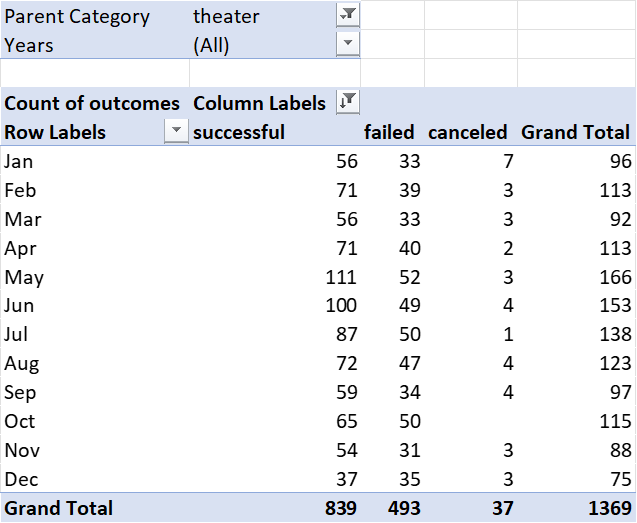
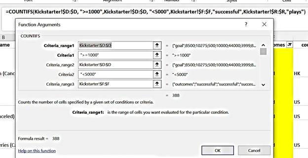
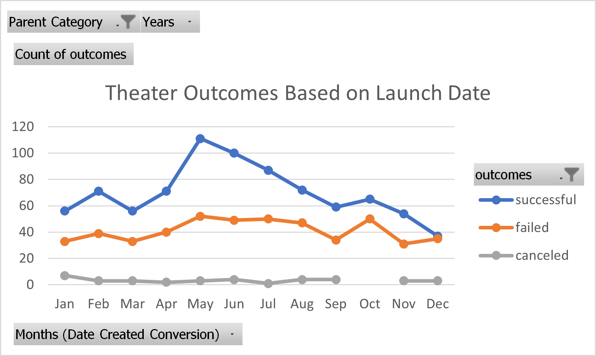
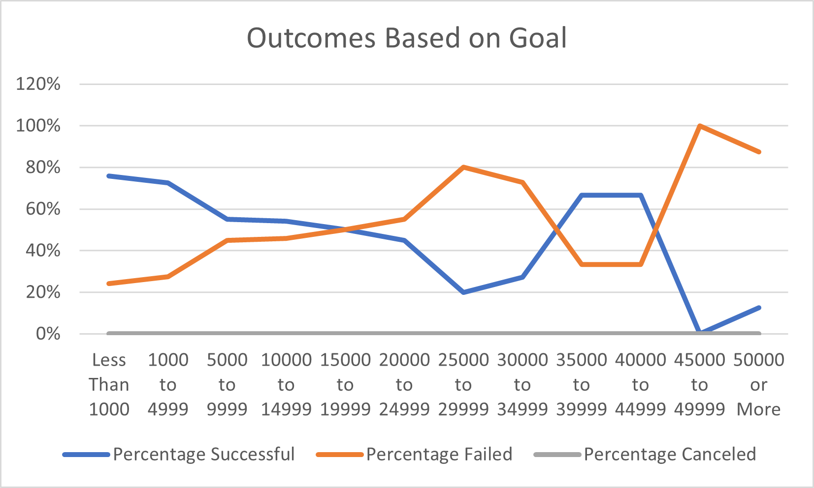

# An Analysis of Kickstarter Campaigns
Performing analysis on Kickstarter data to uncover trends.

## Overview of Project
### Background
The client, Louise, is looking to start a crowdfunding campaign to help fund her upcoming play *Fever*. We want to help her decide what special factors are required in order for her campaign to be succesful, so we use the data from this project to compare and mirror campaigns from other successful ones in the same category to help kickstart Loiuse's production of *Fever*.

### Purpose
The purpose of this project is to help Louise understand the outcomes of different campaigns based on their launch dates and fundraising goals. I will analyze the data from previous Kickstarter campaigns in order to provide recommendations for a successful campaign. This project focuses on campaigns for plays, so Louise is able to set up her campaign for an upcoming play, *Fever*. 

The analysis below describes the process and provides my findings to help her make sound decisions about her upcoming play.

## Analysis and Challenges

### Analysis of Outcomes Based on Launch Date
In order to analyze the data for outcomes based on launch date, I first had to extract the Year from the Date Created Conversion column of the original Kickstarter data. In the Theater Outcomes by Launch Date sheet,I created a Pivot Table to compare the launch dates (in Months) with different Outcomes: Successful, Failed, and Canceled. 

The Pivot Table was filtered by the Parent Category "Theater" and "Years" to show the relevant months for the launch dates. The data in the pivot table provides the count for each specific type of outcome and their relevant grand totals during each month of the year, based on client's request. To help visualize what the pivot table is providing, I created a line graph to show the relationship between outcomes on the y-axis and launch month on the x-axis. This will be further analyzed in the Results section below.

### Analysis of Outcomes Based on Goals
In order to analyze the data for outcome and its relationship to fundraising goal amounts, I created the following table in the Outcomes Based on Goals sheet within the Kickstarter file.

This table has 12 rows and 8 columns, where the rows were broken down into dollar-amount ranges so the projects can be grouped based on their goal amounts and columns were broken up by Outcomes that were "Successful", "Canceled", and "Failed" counts, including a sum of each project and the percentage of each outcome category based on the total projects. 

In order to calculate the "Number Successful", "Number Failed", and "Number Canceled" columns, I used the COUNTIF() function, with a variation in the formulas and utilizing absolute cell references, based on the following criteria: 
*where >= is the lowest goal amount of the given range amount in the Goal column
*where <= is the highest goal amount of the given range amount in the Goal column
*where the Subcategory column from the Kickstarter dataset is filterd for "plays"
*where the correct number of "Successful", "Failed", or "Canceled" outcomes are indicated from the Outcomes column of the Kickstarter dataset

Here is an example of the Function Arguments and full formula I used to calculate the Number of Successful Outcomes whose Goal ranged from 1000 to 4999: 

I used the SUM() function to calculate the Total Projects columns for each type of Outcome that met the given Goal range. For example, to calculate the total projects whose Goal was less than $1000, the formula SUM(B2:D2) was used. In order to calculate the percentage of successful, failed, and canceled projects for each row, I divided each Outcome type by the Total Projects. For example, to calculate the Percentage Failed whose Goal amount ranged from $1000 to $4999, I used the formula =(C3/E3), which is the Number Failed for the 1000-4999 row divided by Total Projects in that row. After I copied the formula down for each row, I changed the column to Percentage number type with no decimals. This step could also be done by multiplying the formula by 100 to show the value as a percentage: =(C3:D3)*100, and rounding to a whole number or no decimal places.

Finally, to help visualize what the Outcomes_vs_Goals table is providing, I created a line graph to show the relationship between goal-amount ranges on the x-axis and the percentage of successful, failed, or canceled projects on the y-axis. This will be further analyzed in the Results section below.

### Challenges and Difficulties Encountered
As mentioned above, I used the Absolute cell reference when using the COUNTIF() function to calculate the "Number Successful", "Number Failed", and "Number Canceled" in the Outcome Based on Goals sheet. I did this to make the process easier as I was able to copy down rows and across columns, instead of having to manually change the formula for each Outcome type and Range row. 

Another challenge I faced was when using the COUNTIF() formula for the Number Successful in the 1000 to 4999 row. I accidentally typed 1000 to 4000 and was using "<=1000" for Criteria1 and "<=4000" in Criteria2, which led to an incorrect count in the table. After fixing the range values to the correct amount and adjusting Criteria2 to say "<5000", I was able to verify the correct count using the Filters in the original dataset as shown below:

With such long formulas like the COUNTIF() ones used for this data, it shows me how important it is to pay attention to details when typing in the cells and using the correct format to ensure each quotation mark, comma, and inequality symbol is correctly placed within the formula box.

## Results

### What are two conclusions you can draw about the Outcomes based on Launch Date?
Using the following graph, we can draw some conclusions about the Outcomes based on Launch Date to help Loiuse make her decision on when to launch, or not launch, her campaign.

#### Theater Outcomes based on Launch Dates: Conclusion 1
From the line graph above, we can see that the orange line tells us the most successful launches occurred in May, followed by June and July. Additionally, the yellow line shows that the number of failed launches within these months were also higher compared to other months, with the exception of October. This indicates that overall, there are more campaign launches within these three months than the other months. This can also be verified in our Pivot Table above, in the Grand Total column. Although there is an increase in both Successful and Failed launches in May, June, and July, there is still a higher number of successful campaigns launched within these months. We can also see from this graph that our canceled campaigns are consistent througout the year, which means there are factors other than timing that are causing cancellations. Therefore, if Louise is looking for a good launch date, should should think about starting in May, which has the highest chance of being a successful campaign. 

#### Theater Outcomes based on Launch Dates: Conclusion 2
Another conclusion we can make based on the line graph above is that December is a not a good time for Loiuse to launch her campaign. This is indicated by the lowest point on our orange line, showing the least successful campaigns. Our yellow line shows us that failed campaigns is also close to the number of successful ones. Further indicating that December would not lead to good campaign results.

### What can you conclude about the Outcomes based on Goals?
Using the following graph, we can draw some conclusions about the Outcomes based on Fundraising Goals to help Loiuse make her decision on how much to set her fundraising goal in order for the *Fever* campaign launch to be successful.

#### Outcomes based on Goals: Conclusion
Based on the Outcomes_vs_Goals graph above, it is difficult to make any valid conclusions to help Louise make a solid decision on how much she should set her fundraising goal to. However, there is sufficient evidence to say that the lower amount she sets her goal on, the more likely it will be successful. There is a higher chance of successfully meeting her goal with a fundraising amount less than $5,000 as well as setting her goal between $35,000 and less than $45,000. These ranges indicate higher percentage of success than fail rates. However, with less campaigns running at the higher ranges, this data does not provide a good indication of success rates setting higher goals. Additionally, we can see that campaign goals more than $45,000 have a high fail rate and should not be used by Louise. 

### Summary of Limitations and Recommendations

#### What are some limitations of this dataset?
If Louise is asking us to help her make a decision today based on the Kickstarter data, I would recommend doing additional research on why and how people contributed to campaigns to give us a better picture. Additionally, we would need more recent data to include the years 2018 and higher. This will give us a larger dataset to evaluate, so we can provide more valid conclusions to help Loiuse make decisions on how she should be campaigning, along with launch dates and fundraising goals, to help her *Fever* campaign to be more successful.

#### What are some other possible tables and/or graphs that we could create?
Other possible tables and/or graphs we could create based on the data given are using the data to analyze the relationship between pledges received and how many backers and an analysis of the launch dates and deadline to get a better understanding of when campaigns are successful based on their start and end times. 
